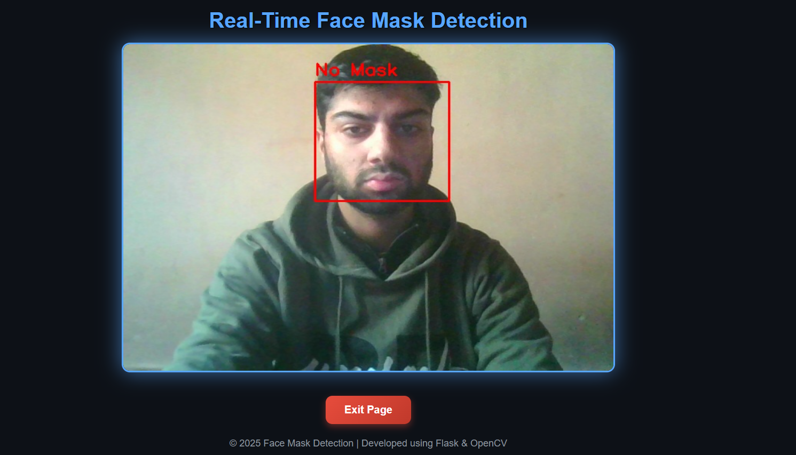

# Face Mask Detection with Live Alert System

## Overview

This project detects whether a person is wearing a face mask or not using **TensorFlow/Keras**, **OpenCV**, and **Flask**.
It performs **real-time detection via webcam**, plays an **alert sound** for “No Mask”, and provides a **modern Flask web interface** with start/stop controls.

---

## Features

*  Real-time face detection via webcam using OpenCV
*  Deep Learning (CNN) model trained on Kaggle dataset
*  1.5-second interval audio alert for “No Mask”
*  Flask web interface with camera control and exit page
*  Clean and responsive UI using CSS3
*  Automatic camera management for stable performance

---

## Technologies Used

| Component       | Technology               |
| --------------- | ------------------------ |
| ML Model        | TensorFlow / Keras       |
| Computer Vision | OpenCV                   |
| Backend         | Flask (Python)           |
| UI              | HTML, CSS                |
| Audio           | Pygame                |
| Dataset         | Kaggle Face Mask Dataset |

---

## Folder Structure

```
Face-Detection/
│
├── app/
│   ├── app.py                
│   ├── templates/
│   │   ├── index.html       
│   │   ├── exit.html         
│   └── static/
│       └── style.css         
│
├── src/
│   ├── data_loader.py       
│   ├── model_builder.py      
│   ├── detect_mask_video.py  
│   ├── utils.py             
├── outputs/
│   └── mask_detector_model.keras 
│
├── Data/                     
├── main.py                                    
└── README.md
```

---

## Model Architecture

**CNN (Convolutional Neural Network)** classifies images into:

* **Mask (0)**
* **No Mask (1)**

```
Input (128x128x3)
 ├─ Conv2D(32, ReLU) → MaxPooling2D
 ├─ Conv2D(64, ReLU) → MaxPooling2D
 ├─ Flatten
 ├─ Dense(128, ReLU) → Dropout(0.5)
 └─ Dense(1, Sigmoid)
```

---

## Demo

### Detection Example




---

## How to Run the Project

### 1️⃣ Install Dependencies

```bash
pip install -r requirements.txt
```

### 2️⃣ Train the Model

```bash
python main.py
```

### 3️⃣ Run Flask App

```bash
python app/app.py
```

Visit in browser:

```
http://127.0.0.1:5000
```

### 4️⃣ Stop or Restart Camera

* Click **“Exit Page”** → Webcam stops safely.
* Click **“Restart Detection”** → Starts detection again.

---

## Sound Alert System

* Plays an alert when **“No Mask”** is detected.
* Interval between alerts: **2.5 seconds** (configurable in `utils.py`).
* You can replace alert sound with your custom `.wav` file in `/static/alert.wav`.

---

## Requirements

```
Python 3.10+
TensorFlow >= 2.12
OpenCV >= 4.7
Flask >= 2.3
pygame
numpy
```

Install them using:

```bash
pip install -r requirements.txt
```

---

## License

This project is licensed under the **MIT License**.
